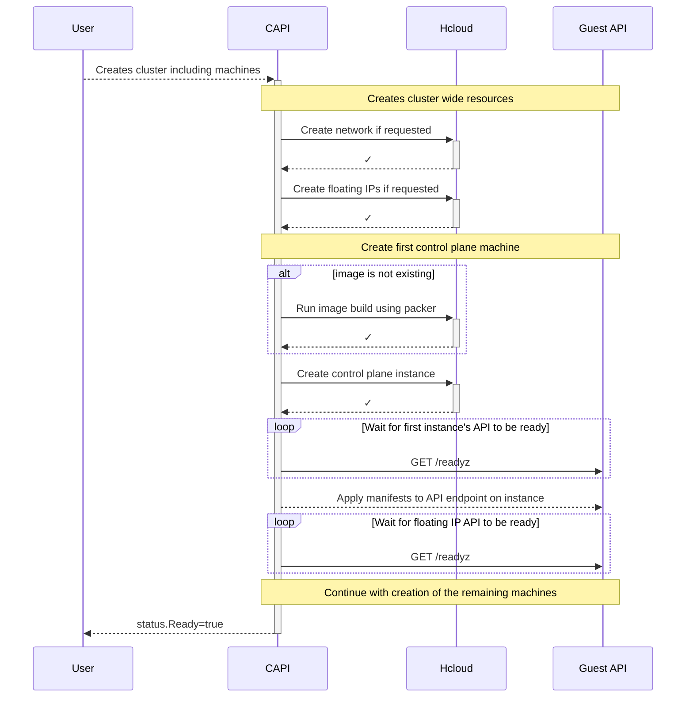

# Design

## Simplified cluster creating

```mermaid
sequenceDiagram
    participant User
    participant CAPI
    participant CAPI
    participant Hcloud
    participant Guest API
    User -->>+ CAPI: Creates cluster including machines
    Note over CAPI,Guest API: Creates cluster wide resources
    CAPI ->>+ Hcloud: Create network if requested
    Hcloud-->>-CAPI: ✓
    CAPI ->>+ Hcloud: Create floating IPs if requested
    Hcloud-->>-CAPI: ✓
    Note over CAPI,Guest API: Create first control plane machine
    alt image is not existing
        CAPI ->>+ Hcloud: Run image build using packer
        Hcloud-->>-CAPI: ✓
    end
    CAPI ->>+ Hcloud: Create control plane instance
    Hcloud-->>-CAPI: ✓
    loop Wait for first instance's API to be ready
        CAPI->>Guest API: GET /readyz
    end
    CAPI -->> Guest API: Apply manifests to API endpoint on instance
    loop Wait for floating IP API to be ready
        CAPI->>Guest API: GET /readyz
    end
    Note over CAPI,Guest API: Continue with creation of the remaining machines
    CAPI-->>-User: status.Ready=true

```
